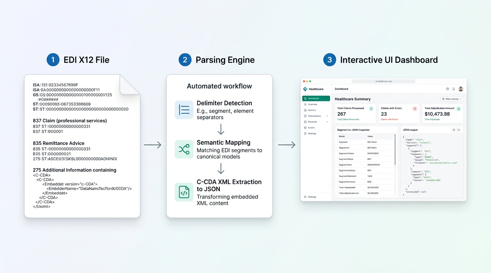
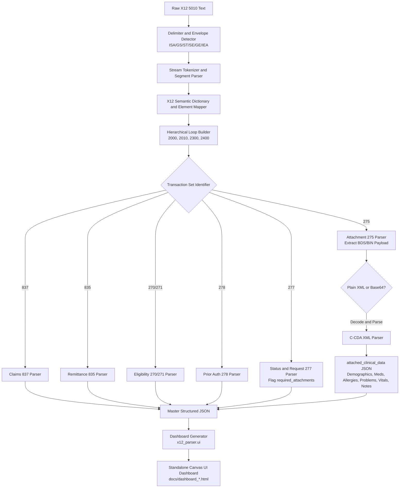

# Production-Ready EDI X12-to-JSON Healthcare Parser and C-CDA XML Integration Engine

An enterprise-grade, zero-dependency, modular EDI X12 (Version 5010) to structured JSON parser featuring automated Consolidated Clinical Document Architecture (C-CDA R2.1/R1.1) XML payload extraction, healthcare semantic key mapping, interactive Canvas UI visual dashboards, and OpenAPI / Plugin manifests.

<p align="center">
  
</p>

---

## 1. Non-Technical Overview: How to Use This Skill

### What is EDI X12?
In the United States healthcare system, hospitals, doctor offices, pharmacies, clearinghouses, and insurance companies exchange administrative and clinical information using an electronic standard called **EDI X12** (Electronic Data Interchange, Version 5010).

Raw EDI files are composed of short, coded text segments separated by asterisks and tildes (for example: `CLM*98124*450.00***11:B:1*Y*A*Y*Y~`). While computers process these formats efficiently, humans cannot easily read them without consulting specialized technical manuals.

### What Does This Skill Do?
This skill translates cryptic healthcare EDI files into plain English, structured JSON data, and visual dashboards. It automatically:
- Identifies who is sending and receiving the information (such as doctors, clinics, patients, and insurance payers).
- Extracts billing numbers, dollar amounts, procedure codes, diagnosis codes, and payment decisions.
- Highlights whether an insurance claim was approved, paid in full, partially paid, or denied.
- Detects requests for missing medical records and unpackages embedded doctor notes, patient vitals, medication lists, and allergy records.
- Generates interactive, visual web dashboards that allow anyone to view and inspect transaction details in a standard web browser.

---

### Non-Technical Examples

#### Example 1: Reviewing an Insurance Payment and Denial (835 Remittance Advice)
- **The Situation**: An insurance payer sends a payment notification file (`835`), but some claims were only partially paid or rejected.
- **How to Use**: Provide the raw text or file to the skill (or run `python3 -m x12_parser.cli sample_data/sample_835_remittance.x12 --html payment_summary.html`).
- **What You See**:
  - The total dollar amount transferred via ACH or check.
  - A clean breakdown of each patient claim, showing the amount billed by the clinic ($450.00), the amount paid by the insurance company ($375.00), and the patient responsibility ($75.00).
  - Clear explanations of adjustment reason codes (such as contractual write-offs or deductible obligations) rather than raw codes like `CAS*CO*45`.

#### Example 2: Checking Why a Claim is Pending and What Records are Needed (277 Status Request)
- **The Situation**: A healthcare claim is stuck in a "pended" state because the insurance company requires additional proof before approving coverage.
- **How to Use**: Pass the status notification file to the parser or view its generated dashboard.
- **What You See**:
  - A clear alert stating that documentation is required.
  - The exact type of medical record requested (for example: "Code 09: Medical Necessity Progress Note").
  - The required electronic transmission method and tracking control numbers.

#### Example 3: Inspecting Attached Medical Records (275 Attachment with C-CDA XML)
- **The Situation**: A clinic sends patient clinical history and justification attached directly inside an electronic envelope (`275`).
- **How to Use**: Parse the file using the CLI, API, or visual dashboard.
- **What You See**:
  - The embedded clinical document is automatically extracted, decoded, and organized into readable sections:
    - **Patient Demographics**: Name, date of birth, gender, and contact details.
    - **Active Medications**: Prescriptions, dosages, and RxNorm codes (such as Lisinopril 20mg).
    - **Allergies and Reactions**: Substances and recorded adverse reactions (such as Penicillin hives).
    - **Medical Diagnoses**: Documented conditions and ICD-10 codes (such as Essential Hypertension).
    - **Doctor Evaluation Notes**: The full physician narrative explaining why the treatment is medically necessary.

#### Example 4: Using the Visual Web Dashboard Without Writing Code
- **How to Use**: Open any of the pre-generated dashboards in `docs/` (e.g., `docs/dashboard_837_claim.html` or `docs/x12_mapping_dashboard.html`) in Google Chrome, Safari, or Microsoft Edge.
- **What You Can Do**:
  - Toggle between Light and Dark modes.
  - Drag and drop your own `.x12` or `.edi` file to immediately view its metrics, participant cards, and financial breakdown.
  - Search for specific terms, codes, or patient names using the real-time search bar.
  - Copy or download the clean structured JSON file with a single click.

---

## 2. Supported EDI X12 Transaction Sets (5010)

| Category | Transaction Set | Description | Implementation Spec |
| :--- | :--- | :--- | :--- |
| **Eligibility Checking** | **270** | Health Care Eligibility Benefit Inquiry | `005010X279A1` |
| | **271** | Health Care Eligibility Benefit Response | `005010X279A1` |
| **Prior Authorization** | **278** | Health Care Services Review (Request / Response) | `005010X217` |
| **Billing and Payment** | **837** | Health Care Claim (Professional / Institutional) | `005010X222A1` / `005010X223A2` |
| | **835** | Health Care Claim Payment / Remittance Advice | `005010X221A1` |
| **Clinical Attachments** | **277** | Request for Additional Information / Claim Status | `005010X212` / `005010X214` |
| | **275** | Patient Information Attachment Envelope | `005010X210` / `005010X218` |

---

## 3. Core Architecture and Processing Pipeline



### A. Base X12 to JSON Engine
- **Delimiter Auto-Detection**: Dynamically extracts element separator (`*`), component sub-delimiter (`:`), repetition separator (`^`), and segment terminators (`~`, `\n`) from the standard 106-character `ISA` header.
- **Hierarchical Loop Assembly**: Groups segments into standard loops (`Loop 2000A`, `2000B`, `2010AA`, `2300`, `2400`) instead of flat lists.
- **Human-Readable Key Mapping**: Resolves cryptic segment and element IDs (e.g., `BHT02` to `beginning_transaction_purpose_code`, `CLM02` to `total_claim_charge_amount`, `CLP04` to `claim_payment_amount`).

### B. C-CDA XML Integration Logic (277/275 Loop)
- **277 Request for Additional Information**: Automatically parses `STC` (Category `R0` to `R5`, Action `A4`) and `PWK` segments to populate a unified `required_attachments` array with report type codes (e.g., `09` = Progress Report), transmission methods (`EL` = Electronic), and tracking numbers.
- **275 Attachment Payload Extraction**: Locates `BDS` and `BIN` segments, identifies whether the payload is raw C-CDA XML or Base64-encoded, and passes it to the `CCDAParser`.
- **C-CDA Structured Output (`attached_clinical_data`)**:
  - **Document Metadata**: Title, Document ID, Effective Date, Author, Custodian.
  - **Patient Demographics**: Name, DOB, Gender, Race/Ethnicity, Address, Phone, MRN.
  - **Allergies and Intolerances**: Substance, RxNorm code, Reaction, Severity, Status.
  - **Medications**: Medication Name, RxNorm code, Dose, Route, Status, Dates.
  - **Problems and Diagnoses**: Condition Name, ICD-10 / SNOMED code, Status, Onset.
  - **Vital Signs**: Systolic/Diastolic BP, Heart Rate, SpO2, BMI, Measurement Dates.
  - **Encounter and Notes**: Chief Complaint, Assessment and Plan, Progress Notes and Medical Necessity Justification.

---

## 4. Current Project Structure and File Tree

```
x12-to-json-parser/
├── LICENSE                             # Apache 2.0 Open Source License
├── README.md                           # Comprehensive documentation and non-technical guide
├── requirements.txt                    # Python package dependencies (Standard library core)
├── setup.py                            # Package installation and setup configuration
├── docs/                               # Documentation, visual guides, and rendered dashboards
│   ├── dashboard_275_ccda.html         # Interactive dashboard for 275 C-CDA clinical response
│   ├── dashboard_277_request.html      # Interactive dashboard for 277 attachment request
│   ├── dashboard_835_remittance.html   # Interactive dashboard for 835 claim payment/remittance
│   ├── dashboard_837_claim.html        # Interactive dashboard for 837 healthcare claim
│   ├── x12_mapping_dashboard.html      # Master semantic field dictionary and live converter
│   └── images/
│       └── x12_skill_demo.jpg          # Enterprise overview and architecture visual
├── sample_data/                        # Realistic EDI X12 5010 sample transaction files
│   ├── sample_270_inquiry.x12          # 270 Eligibility Benefit Inquiry
│   ├── sample_271_response.x12         # 271 Eligibility Benefit Response
│   ├── sample_275_ccda_response.x12    # 275 Clinical Attachment with embedded C-CDA XML
│   ├── sample_277_request.x12          # 277 Claim Status Request flagging required records
│   ├── sample_278_prior_auth.x12       # 278 Prior Authorization Request
│   ├── sample_835_remittance.x12       # 835 Remittance Advice with adjudications and CARC codes
│   └── sample_837_claim.x12            # 837 Professional/Institutional Health Care Claim
├── skills/                             # Agent Skill Definitions
│   └── x12-healthcare-parser/
│       └── SKILL.md                    # Skill specification and Canvas UI instructions
├── tests/                              # Comprehensive test suite (20 automated unit tests)
│   ├── run_all_tests.py                # Master test runner with execution summary
│   ├── test_277_attachment_request.py  # Tests for 277 status and required attachment flagging
│   ├── test_api_and_manifests.py       # Tests for REST API, manifests, and dashboard generation
│   ├── test_ccda_extraction.py         # Tests for 275 C-CDA XML and Base64 payload extraction
│   ├── test_data_integrity.py          # Data integrity tests for 837, 835, 270, 271, 278
│   └── test_engine_structure.py        # Tokenizer, custom delimiters, and envelope tests
├── x12_parser/                         # Core Python Package Source Code
│   ├── __init__.py                     # Library exports (X12Parser, CCDAParser, generate_html_dashboard)
│   ├── cli.py                          # Command-line interface with --html and --summary support
│   ├── api/                            # HTTP REST API Server and OpenAPI Definitions
│   │   ├── openapi.json                # OpenAPI 3.1.0 JSON specification
│   │   ├── openapi.yaml                # OpenAPI 3.1.0 YAML specification
│   │   └── server.py                   # Zero-dependency HTTP REST API server
│   ├── clinical_parsers/               # Clinical XML Extractors
│   │   └── ccda_parser.py              # HL7 C-CDA R2.1/R1.1 structured XML parser
│   ├── engine/                         # Base Parsing Engine and Orchestrators
│   │   ├── base_parser.py              # Master X12Parser coordinator and dashboard API
│   │   ├── dictionary.py               # 5010 data dictionary and semantic field mappings
│   │   ├── loop_builder.py             # Hierarchical loop tree constructor
│   │   ├── segment_parser.py           # Element and composite sub-element parser
│   │   └── tokenizer.py                # Stream tokenizer and dynamic delimiter detector
│   ├── manifests/                      # Plugin and Skill Manifests
│   │   ├── ai-plugin.json              # Enterprise AI Plugin manifest
│   │   └── skill-manifest.json         # LLM Skill Manifest with Canvas UI configuration
│   ├── transaction_parsers/            # Specialized 5010 Transaction Handlers
│   │   ├── attachment_275.py           # 275 Attachment Parser and BDS/BIN extractor
│   │   ├── claims_837.py               # 837 Claims Parser (Loop 2000A/B, 2300, 2400)
│   │   ├── eligibility_270_271.py       # 270 Inquiry and 271 Response Parser
│   │   ├── prior_auth_278.py           # 278 Prior Authorization Parser
│   │   ├── remittance_835.py           # 835 Remittance Advice Parser (BPR, CLP, CAS, SVC)
│   │   └── status_request_277.py       # 277 Status Request and attachment flagger
│   └── ui/                             # Visual Dashboard and Canvas UI Generator
│       ├── dashboard_generator.py      # Standalone HTML dashboard generation engine
│       └── x12_mapping_dashboard.html  # Master semantic field dictionary web asset
└── scripts/
    └── copy_to_local.sh                # Archive and synchronization helper script
```

---

## 5. Usage and Quickstart

### Python Library Usage

```python
from x12_parser import X12Parser

raw_x12 = """ISA*00*          *00*          *ZZ*SUBMITTER123   *ZZ*RECEIVER456    *260814*1430*^*00501*000000001*0*P*:~
GS*HC*SUBMITTER123*RECEIVER456*20260814*1430*1*X*005010X222A1~
ST*837*0001*005010X222A1~
...
SE*26*0001~
GE*1*1~
IEA*1*000000001~"""

# Option 1: Parse to Python dictionary / JSON
parsed = X12Parser.parse(raw_x12)
print(parsed["summary"])
print(parsed["functional_groups"][0]["transaction_sets"][0]["parsed_transaction"])

# Option 2: Generate an interactive visual HTML dashboard for this transaction
html_dashboard = X12Parser.generate_dashboard(raw_x12, output_path="claim_dashboard.html")
```

### Command Line Interface (CLI)

```bash
# Print a human-readable summary of transaction contents
python3 -m x12_parser.cli sample_data/sample_837_claim.x12 --summary

# Parse any X12 file and generate an interactive HTML visual dashboard
python3 -m x12_parser.cli sample_data/sample_837_claim.x12 --html dashboard_837.html

# Parse to a formatted JSON file
python3 -m x12_parser.cli sample_data/sample_275_ccda_response.x12 -o output_275.json --pretty

# Pipe raw X12 directly from stdin
cat sample_data/sample_835_remittance.x12 | python3 -m x12_parser.cli - --html dashboard_835.html
```

### Interactive Canvas UI Visual Dashboards

The project provides interactive, responsive Canvas UI dashboards designed for browser viewing and AI agent canvas environments:
- **Interactive Segment-to-JSON Inspector**: Click any raw EDI segment to highlight its target JSON property, loop definition, and syntax rules.
- **Section-by-Section Semantic Field Dictionary**: Comprehensive explanations for Envelopes (`ISA`/`GS`/`ST`), Entities (`NM1`/`N3`/`N4`/`DMG`), Claims (`CLM`/`HI`/`SV1`), Remittance (`BPR`/`CLP`/`CAS`/`SVC`), Status Requests (`STC`/`PWK`), and C-CDA XML payloads (`BDS`/`BIN`).
- **Theme Switcher**: Native Light/Dark toggle supporting standard CSS theme variables.
- **Live Search and Filter**: Real-time lookup by segment ID, JSON key, or healthcare business term.
- **Custom File Drag-and-Drop**: Upload or paste any custom `.x12` file to generate and inspect its dashboard in real time.

---

### Running the HTTP REST API Server

```bash
# Launch server on port 8000
python3 -m x12_parser.api.server 8000
```

Endpoints:
- `POST /v1/parse/x12`: Parse raw EDI text in JSON body (`{"raw_x12": "..."}`) or plain text (supports `format: "html"` for direct dashboard output).
- `GET /dashboard`: Master interactive Canvas UI visual mapping dashboard.
- `POST /v1/dashboard/generate`: Generate and return customized dashboard HTML for supplied X12 text.
- `GET /v1/health`: Service health check.
- `GET /openapi.json`: OpenAPI 3.1.0 specification.
- `GET /.well-known/ai-plugin.json`: AI Plugin manifest.
- `GET /skill-manifest.json`: LLM Skill manifest.

---

## 6. Running the Test Suite

Execute all 20 unit and integration test cases:

```bash
python3 tests/run_all_tests.py
```

Expected Output:
```
======================================================================
RUNNING X12 HEALTHCARE PARSER & C-CDA TEST SUITE
======================================================================
test_277_flags_required_attachments ... ok
test_ai_plugin_manifest ... ok
test_generate_dashboard_any_x12_file ... ok
test_openapi_json_schema ... ok
test_server_dashboard_endpoint ... ok
test_server_health_endpoint ... ok
test_server_parse_275_ccda_post ... ok
test_server_parse_837_post ... ok
test_server_parse_and_build_html_dashboard ... ok
test_skill_manifest ... ok
test_275_base64_encoded_payload ... ok
test_275_embedded_ccda_extraction ... ok
test_271_eligibility_integrity ... ok
test_278_prior_auth_integrity ... ok
test_835_remittance_integrity ... ok
test_837_claim_data_integrity ... ok
test_custom_delimiters ... ok
test_delimiter_detection_standard ... ok
test_envelope_hierarchy ... ok
test_summary_counts ... ok

----------------------------------------------------------------------
Ran 20 tests in 0.67s

OK
======================================================================
TEST SUITE EXECUTION SUMMARY
======================================================================
Total Tests Executed: 20
Passed:               20
Failures:             0
Errors:               0
======================================================================
>> ALL TEST CASES PASSED SUCCESSFULLY (100% SUCCESS RATE) <<
```

---

## 7. Enterprise Plugin and Skill Integration

### Manifest (`ai-plugin.json`)
```json
{
  "schema_version": "1.0",
  "name_for_model": "X12_Healthcare_Parser",
  "description_for_model": "Use this skill when the user provides raw EDI X12 healthcare transaction text (such as 270, 271, 277, 275, 278, 837, 835) or embedded C-CDA XML clinical documents, and needs them translated into human-readable or machine-processable structured JSON format.",
  "api": {
    "type": "openapi",
    "url": "http://localhost:8000/openapi.json"
  }
}
```

---

## 8. Project Location and Archive

The entire codebase is located in the root repository directory:
```bash
./x12-to-json-parser
```

A standalone backup archive can be created via:
```bash
./scripts/copy_to_local.sh
```
which exports the project archive to `/tmp/x12-to-json-parser-export.tar.gz`.

---

## 9. License

This project is licensed under the Apache License 2.0. See the [LICENSE](LICENSE) file for details.
