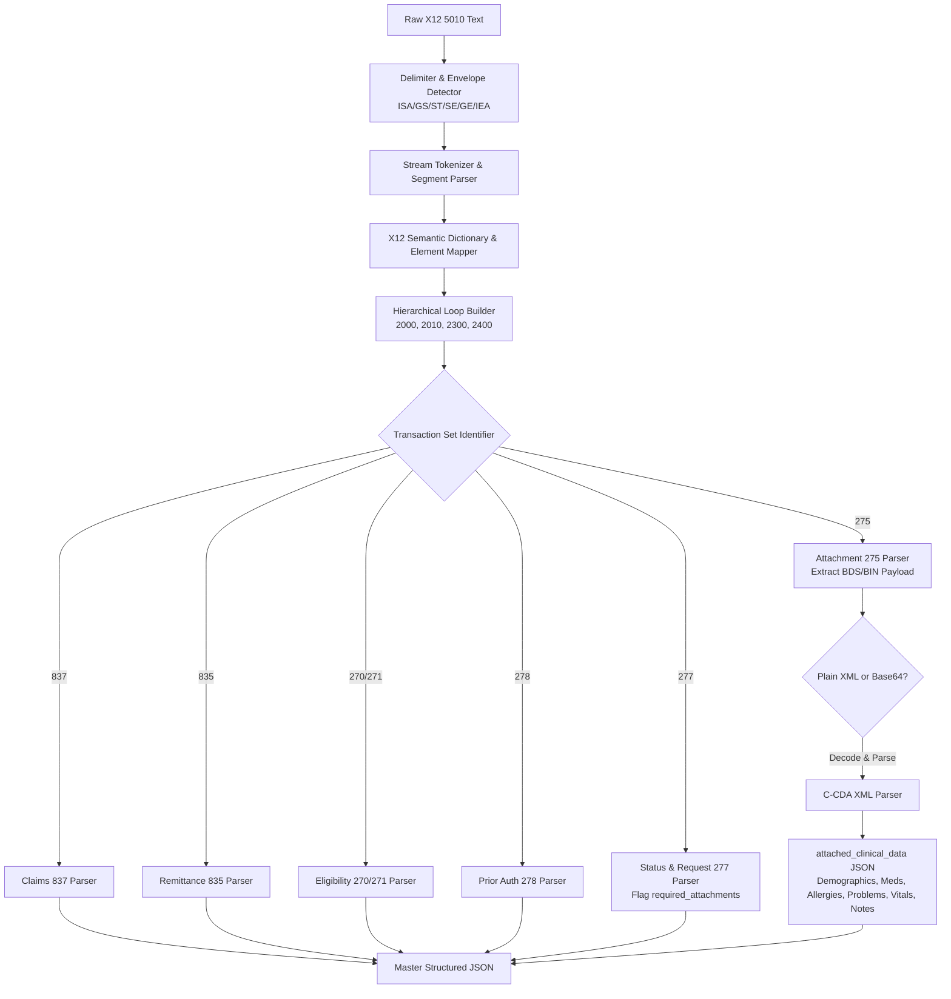

# Production-Ready EDI X12-to-JSON Healthcare Parser & C-CDA XML Integration Engine

An enterprise-grade, zero-dependency, modular EDI X12 (Version 5010) to structured JSON parser featuring automated Consolidated Clinical Document Architecture (C-CDA R2.1/R1.1) XML payload extraction, healthcare semantic key mapping, and a Gemini Enterprise / OpenAI Plugin specification.

---

## 1. Supported EDI X12 Transaction Sets (5010)

| Category | Transaction Set | Description | Implementation Spec |
| :--- | :--- | :--- | :--- |
| **Eligibility Checking** | **270** | Health Care Eligibility Benefit Inquiry | `005010X279A1` |
| | **271** | Health Care Eligibility Benefit Response | `005010X279A1` |
| **Prior Authorization** | **278** | Health Care Services Review (Request / Response) | `005010X217` |
| **Billing & Payment** | **837** | Health Care Claim (Professional / Institutional) | `005010X222A1` / `005010X223A2` |
| | **835** | Health Care Claim Payment / Remittance Advice | `005010X221A1` |
| **Clinical Attachments** | **277** | Request for Additional Information / Claim Status | `005010X212` / `005010X214` |
| | **275** | Patient Information Attachment Envelope | `005010X210` / `005010X218` |

---

## 2. Core Architecture & Logic



### A. Base X12 to JSON Engine
- **Delimiter Auto-Detection**: Dynamically extracts element separator (`*`), component sub-delimiter (`:`), repetition separator (`^`), and segment terminators (`~`, `\n`) from the standard 106-character `ISA` header.
- **Hierarchical Loop Assembly**: Groups segments into standard loops (`Loop 2000A`, `2000B`, `2010AA`, `2300`, `2400`) instead of flat lists.
- **Human-Readable Key Mapping**: Resolves cryptic segment and element IDs (e.g. `BHT02` &rarr; `beginning_transaction_purpose_code`, `CLM02` &rarr; `total_claim_charge_amount`, `CLP04` &rarr; `claim_payment_amount`).

### B. C-CDA XML Integration Logic (277/275 Loop)
- **277 Request for Additional Information**: Automatically parses `STC` (Category `R0`–`R5`, Action `A4`) and `PWK` segments to populate a unified `required_attachments` array with report type codes (e.g. `09` = Progress Report), transmission methods (`EL` = Electronic), and tracking numbers.
- **275 Attachment Payload Extraction**: Locates `BDS` and `BIN` segments, identifies whether the payload is raw C-CDA XML or Base64-encoded, and passes it to the `CCDAParser`.
- **C-CDA Structured Output (`attached_clinical_data`)**:
  - **Document Metadata**: Title, Document ID, Effective Date, Author, Custodian.
  - **Patient Demographics**: Name, DOB, Gender, Race/Ethnicity, Address, Phone, MRN.
  - **Allergies & Intolerances**: Substance, RxNorm code, Reaction, Severity, Status.
  - **Medications**: Medication Name, RxNorm code, Dose, Route, Status, Dates.
  - **Problems / Diagnoses**: Condition Name, ICD-10 / SNOMED code, Status, Onset.
  - **Vital Signs**: Systolic/Diastolic BP, Heart Rate, SpO2, BMI, Measurement Dates.
  - **Encounter & Notes**: Chief Complaint, Assessment & Plan, Progress Notes & Medical Necessity Justification.

---

## 3. Directory Structure

```
/usr/local/google/home/rolandmm/Projects/x12-to-json-parser/
├── README.md                           # Comprehensive documentation
├── requirements.txt                    # Project dependencies
├── setup.py                            # Package setup configuration
├── x12_parser/
│   ├── __init__.py                     # Package exports (X12Parser, CCDAParser)
│   ├── cli.py                          # CLI tool interface
│   ├── engine/
│   │   ├── tokenizer.py                # Delimiter detection & stream tokenizer
│   │   ├── segment_parser.py           # Element & composite sub-element parser
│   │   ├── loop_builder.py             # Hierarchical loop tree builder
│   │   ├── dictionary.py               # 5010 data dictionary & semantic key mappings
│   │   └── base_parser.py              # Master X12Parser engine coordinator
│   ├── transaction_parsers/
│   │   ├── eligibility_270_271.py       # 270 Inquiry & 271 Response
│   │   ├── prior_auth_278.py           # 278 Prior Authorization Request/Response
│   │   ├── claims_837.py               # 837 Claims (837P & 837I)
│   │   ├── remittance_835.py           # 835 Electronic Remittance Advice (ERA)
│   │   ├── status_request_277.py       # 277 Request for Information & Attachment Flagger
│   │   └── attachment_275.py           # 275 Patient Information Attachment & BDS Extractor
│   ├── clinical_parsers/
│   │   └── ccda_parser.py              # HL7 C-CDA R2.1/R1.1 XML parser
│   ├── api/
│   │   ├── server.py                   # Zero-dependency HTTP REST API Server
│   │   ├── openapi.json                # OpenAPI 3.1.0 JSON specification
│   │   └── openapi.yaml                # OpenAPI 3.1.0 YAML specification
│   └── manifests/
│       ├── ai-plugin.json              # Gemini Enterprise / App plugin manifest
│       └── skill-manifest.json         # Enterprise LLM Skill manifest
├── sample_data/
│   ├── sample_837_claim.x12            # File 1a: Realistic raw 837 Claim
│   ├── sample_835_remittance.x12       # File 1b: Realistic raw 835 Remittance (partial payment & denials)
│   ├── sample_277_request.x12          # File 2: Realistic raw 277 Requesting Clinical Attachment
│   ├── sample_275_ccda_response.x12    # File 3: Realistic raw 275 with embedded C-CDA XML (John Doe, Lisinopril, progress note)
│   ├── sample_270_inquiry.x12          # Sample 270 Eligibility Inquiry
│   ├── sample_271_response.x12         # Sample 271 Eligibility Response
│   └── sample_278_prior_auth.x12       # Sample 278 Prior Authorization Request
├── tests/
│   ├── test_engine_structure.py        # Envelopes, delimiters, and tokenization tests
│   ├── test_data_integrity.py          # 837/835/270/271/278 data integrity tests
│   ├── test_ccda_extraction.py         # 275 C-CDA XML & Base64 extraction tests
│   ├── test_277_attachment_request.py  # 277 required_attachments tests
│   ├── test_api_and_manifests.py       # OpenAPI and Plugin manifest tests
│   └── run_all_tests.py                # Master test runner
└── scripts/
    └── copy_to_local.sh                # Backup and archive synchronization script
```

---

## 4. Usage & Quickstart

### Python Library Usage

```python
from x12_parser import X12Parser

raw_x12 = """ISA*00*          *00*          *ZZ*SUBMITTER123   *ZZ*RECEIVER456    *260814*1430*^*00501*000000001*0*P*:~
GS*HC*SUBMITTER123*RECEIVER456*20260814*1430*1*X*005010X222A1~
ST*837*0001*005010X222A1~
...
SE*26*0001~
GE*1*1~
IEA*1*000000001~"""

# Parse to Python dictionary / JSON
parsed = X12Parser.parse(raw_x12)
print(parsed["summary"])
print(parsed["functional_groups"][0]["transaction_sets"][0]["parsed_transaction"])
```

### Command Line Interface (CLI)

```bash
# Run summary on a transaction file
python3 -m x12_parser.cli sample_data/sample_837_claim.x12 --summary

# Parse to JSON file
python3 -m x12_parser.cli sample_data/sample_275_ccda_response.x12 -o output_275.json --pretty

# Pipe via stdin
cat sample_data/sample_835_remittance.x12 | python3 -m x12_parser.cli - --pretty
```

### Running the HTTP REST API Server

```bash
# Launch server on port 8000
python3 -m x12_parser.api.server 8000
```

Endpoints:
- `POST /v1/parse/x12`: Parse raw EDI text in JSON body (`{"raw_x12": "..."}`) or plain text
- `GET /v1/health`: Service health check
- `GET /openapi.json`: OpenAPI 3.1 specification
- `GET /.well-known/ai-plugin.json`: Gemini Enterprise Plugin manifest

---

## 5. Running the Test Suite

Execute all 17 unit and integration test cases across the entire pipeline:

```bash
python3 tests/run_all_tests.py
```

Expected Output:
```
======================================================================
RUNNING X12 HEALTHCARE PARSER & C-CDA TEST SUITE
======================================================================
test_277_flags_required_attachments ... ok
test_ai_plugin_manifest ... ok
test_openapi_json_schema ... ok
test_server_health_endpoint ... ok
test_server_parse_275_ccda_post ... ok
test_server_parse_837_post ... ok
test_skill_manifest ... ok
test_275_base64_encoded_payload ... ok
test_275_embedded_ccda_extraction ... ok
test_271_eligibility_integrity ... ok
test_278_prior_auth_integrity ... ok
test_835_remittance_integrity ... ok
test_837_claim_data_integrity ... ok
test_custom_delimiters ... ok
test_delimiter_detection_standard ... ok
test_envelope_hierarchy ... ok
test_summary_counts ... ok
----------------------------------------------------------------------
Ran 17 tests in 0.64s

OK
======================================================================
TEST SUITE EXECUTION SUMMARY
======================================================================
Total Tests Executed: 17
Passed:               17
Failures:             0
Errors:               0
======================================================================
>> ALL TEST CASES PASSED SUCCESSFULLY (100% SUCCESS RATE) <<
```

---

## 6. Enterprise Plugin & Skill Integration

### Manifest (`ai-plugin.json`)
```json
{
  "schema_version": "1.0",
  "name_for_model": "X12_Healthcare_Parser",
  "description_for_model": "Use this skill when the user provides raw EDI X12 healthcare transaction text (such as 270, 271, 277, 275, 278, 837, 835) or embedded C-CDA XML clinical documents, and needs them translated into human-readable or machine-processable structured JSON format.",
  "api": {
    "type": "openapi",
    "url": "http://localhost:8000/openapi.json"
  }
}
```

---

## 7. Local Machine Project Location & Synchronization

The entire codebase is directly installed in the workspace directory:
```
/usr/local/google/home/rolandmm/Projects/x12-to-json-parser
```

A standalone backup archive is also generated at:
```bash
/tmp/x12-to-json-parser-export.tar.gz
```

---

## 8. License

This project is licensed under the Apache License 2.0. See the [LICENSE](file:///usr/local/google/home/rolandmm/Projects/x12-to-json-parser/LICENSE) file for details.

